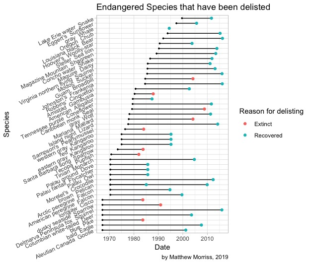
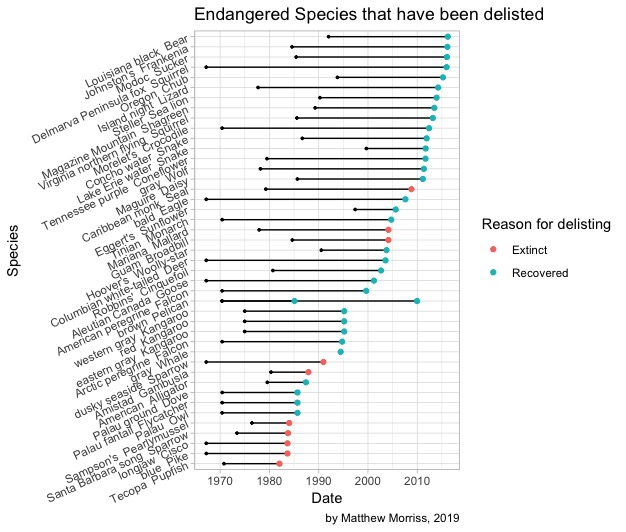

# Endangered Species Analysis
I became curious about the length at which species were listed and delisted from the the Endangered Species list. This project combined a bit of webscraping with some creative ggploting.

Endangered Species by date listed

Endangered Species by delisting date

More analysis and discussion is available on my [blog](https://matthewmorriss.weebly.com/codeblog/endangered-species-listingde-listing).
